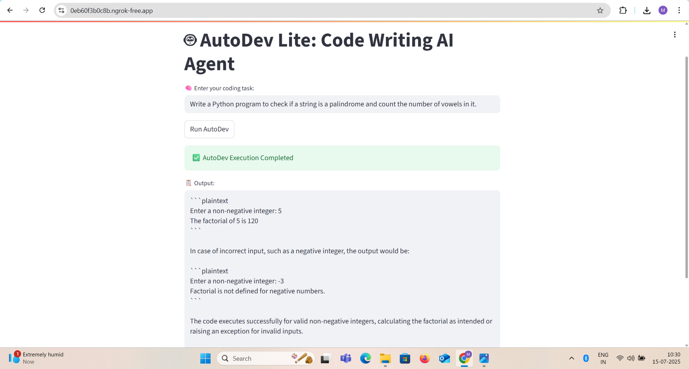

# 🤖 AutoDev Lite: AI Code Writing Agent

AutoDev Lite is a lightweight AI-powered code generation and testing assistant built with [CrewAI](https://docs.crewai.com/), [LangChain](https://www.langchain.com/), and [Streamlit](https://streamlit.io/). It allows users to enter a coding task and see how three AI agents (Planner, Coder, and Tester) collaborate to generate, execute, and verify Python code.

---

## 🎯 Features

- 🧠 **Task Planner Agent**: Breaks down your coding prompt into actionable steps.
- 💻 **Code Writer Agent**: Generates clean Python code based on the plan.
- 🧪 **Code Tester Agent**: Executes the code and returns output or error tracebacks.
- 📦 Powered by [CrewAI](https://docs.crewai.com/) multi-agent workflow.

---

## 📷 App Preview

---

## 🔗 Live App (Ngrok Tunnel from Google Colab)

> ✅ This temporary link is generated each time the notebook is run in Colab:

🔗 [https://0eb60f3b0c8b.ngrok-free.app/](https://0eb60f3b0c8b.ngrok-free.app/)

---
🧠 Tech Stack
Python 3.10+

Streamlit

CrewAI

LangChain

Ngrok

Google Colab

📄 License
This project is released under the MIT License.

🙋‍♂️ Author
Madhusudan Mandal
📧 madhumandal49@gmail.com
📱 +91-9304190347

